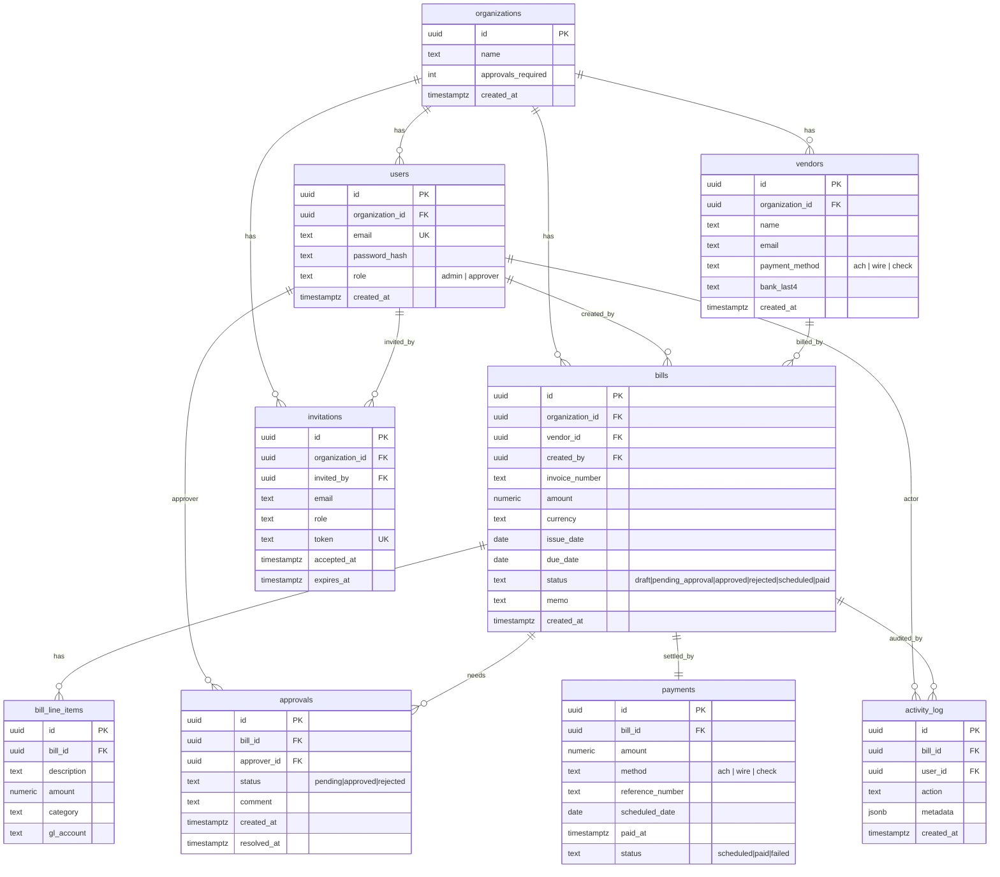

# Payables — Accounts Payable MVP

A small accounts-payable web app inspired by Ramp Bill Pay. A finance team can
onboard vendors, capture bills, route them through an approval workflow, and
track what's owed and what's overdue.

---

## What the product does

Payables is a multi-tenant tool for managing vendor invoices end-to-end:

**Receive invoice → Create bill → Route for approval → Schedule payment → Mark as paid**

Every user, vendor, and bill belongs to an **organization**. Signing up
creates a new org with the signer as its first admin; admins invite
teammates as either `admin` or `approver`. Each org configures how many
distinct approvals a bill needs before it can be paid.

The app gives finance teams a single place to answer: *what do we owe,
to whom, when is it due, and who signed off on it?*

---

## Workflows prioritized

- **Vendor management** — CRUD for vendors with default payment method
  (ACH / wire / check) and bank-account last-4.
- **Bill lifecycle** — create bills with line items, submit for approval,
  approve/reject with comments, schedule and mark paid. Status transitions
  are validated by a server-side state machine; the activity log captures
  every transition with actor + timestamp.
- **Approvers & quorum** — each org sets *N* distinct approvals required.
  Any single rejection sends the bill back. Invitations let admins onboard
  approvers into the org.
- **Reports** — dashboard tiles (outstanding AP, overdue, due this week,
  pending approval) plus a full **AP Aging report** (vendor × Current / 1–30
  / 31–60 / 61–90 / 90+ buckets, against a user-chosen *As-of* date, with
  drill-down and CSV export).

---

## What was left out and why

Since this is a take-home / portfolio test, **none of the items below are
implemented or stubbed in a way that could be considered production-ready**.
They are listed so you can see what a "real" version would need.

| Feature | Why excluded |
|---|---|
| **PDF / OCR invoice ingestion** | Real OCR is its own product surface (Textract/Google DocAI + a review queue for low-confidence fields). High effort, orthogonal to the bill-lifecycle workflow this MVP demonstrates. |
| **In-app notifications** | Would need a notifications table, a delivery worker, read/unread state and a UI tray. Skipped to keep scope tight. |
| **Email notifications for invitations** | Invitations work via an in-app link the admin copies and shares. In production this link would be emailed (SendGrid/SES) — the token model + acceptance endpoint already match what an emailed link would carry. |
| **Public API + webhooks for customers** | A real product needs API keys, scoped tokens, signed webhook deliveries with retries/DLQ, and versioning. Out of scope for an MVP. |
| **Cron / scheduled jobs** | No background scheduler runs to flag overdue bills, send approval reminders, or auto-transition `scheduled → paid` on the scheduled date. Today "overdue" is computed at query time from `due_date < today`. |
| **Automations** | E.g. auto-approve bills under $X from a trusted vendor, auto-route by GL account or amount band, duplicate-invoice detection. Easy to layer on top of the state machine — none built. |
| **Real payments (banking integration)** | Payments are **simulated** — see below. |

### About "simulated" payments

When a user marks a bill paid they enter a reference number (a wire confirmation
or ACH trace ID) and the bill transitions to `paid`. No money actually moves.

A real implementation would slot in at the **service layer** with no changes to
routes or the schema, roughly:

1. Integrate a payment rail — **Modern Treasury** or **Stripe Treasury** are the
   usual choices; both expose ACH, wire, and check-issuance via API.
2. Replace the "mark paid" action with **"submit for payment"**: the service
   calls the provider's *create payment order* endpoint and records the returned
   `external_payment_id` on the `payments` row, transitioning the bill to a new
   `processing` state.
3. Consume the provider's **webhooks** (`payment_order.sent`,
   `payment_order.completed`, `payment_order.failed`) to drive the bill from
   `processing → paid` or `processing → failed`. Webhook handlers must be
   idempotent (key on `external_payment_id` + event id) and signature-verified.
4. Add the operational surface real money requires: a **ledger** of debits/credits,
   reconciliation against bank statements, retry policies for failed payments,
   approver-level dollar limits, and dual-control on the actual release.
5. Treat the bank-account fields on `vendors` as PII — encrypt at rest and gate
   access behind audit logging.

The current code is structured so all of the above lives behind `paymentService`
and the rest of the stack (routes, frontend, state machine) does not change.

---

## Setup instructions

There are two paths: **local dev** (run Postgres in Docker, run the
backend/frontend on your machine for fast iteration) and **full Docker**
(everything containerized, plus a Tailscale Funnel that gives you a stable
public HTTPS URL with no domain).

### Prereqs

- Node.js 24 (an `.nvmrc` pins it — `nvm use`)
- pnpm 11 (`corepack enable pnpm`)
- Docker + the compose plugin

### Local development

```bash
nvm use
corepack enable pnpm
pnpm install

cp apps/backend/.env.example apps/backend/.env
cp apps/frontend/.env.example apps/frontend/.env
# Set JWT_SECRET in apps/backend/.env. DATABASE_URL defaults to the docker postgres.

# Start ONLY the database — backend + frontend run on the host:
docker compose up -d postgres

# Apply migrations and seed demo data:
pnpm nx run backend:migrate
pnpm nx run backend:seed

# Run both apps:
pnpm nx run-many -t serve
# Backend: http://localhost:8080   Frontend: http://localhost:5173
```

The seed creates a **"Payables Demo Co"** organization (configured to
require 2 approvals per bill), demo vendors, and a spread of bills across
statuses. Demo logins (all use password `password123`):

| Email | Role |
|---|---|
| `admin@payables.com` | admin — creates bills, manages team & settings |
| `approver@payables.com` | approver |
| `approver2@payables.com` | approver |
| `approver3@payables.com` | approver |

### Publishing with full Docker + Tailscale Funnel

To run the whole stack (Postgres + backend + nginx-served frontend + a
**stable** public HTTPS URL) on any Linux host with no domain:

```bash
cp .env.example .env
# Set JWT_SECRET and POSTGRES_PASSWORD at minimum.
# Set TS_AUTHKEY (reusable key from the Tailscale admin console) and TS_HOSTNAME.

docker compose up -d --build
```

Run migrations + seed **inside** the backend container:

```bash
docker compose exec backend pnpm exec drizzle-kit migrate
docker compose exec backend pnpm exec tsx src/db/seed.ts
```

The `tailscale` container joins your tailnet and serves the frontend over a
Funnel. The public URL is derived from `TS_HOSTNAME` + your tailnet, so it is
**stable and survives restarts** (the device identity is persisted in the
`tailscale_state` volume):

```bash
docker compose exec tailscale tailscale status
# Public URL: https://<TS_HOSTNAME>.<your-tailnet>.ts.net
```

That URL is HTTPS and serves both the SPA and the `/api` backend behind the
same origin (so no CORS). See [DEPLOY.md](DEPLOY.md) for full Tailscale
setup (auth key, Funnel enablement) and a Cloudflare alternative.

#### Current public URL

> https://payables.<your-tailnet>.ts.net/

> **Note:** this deployment uses **Tailscale Funnel**, which gives a fixed URL
> that does not change across restarts or redeploys. Replace
> `<your-tailnet>` above with your actual tailnet name once deployed.

---

## API usage & user flows

A short, end-to-end walkthrough of the two flows that exercise the bulk of
the API. All endpoints are mounted under `/api`; authenticated calls expect
`Authorization: Bearer <jwt>` returned by `/api/auth/login` or `/api/auth/signup`.
Replace `$URL` with either `http://localhost:8080` (local dev) or the public
Tailscale Funnel URL above.

### Flow 1 — Sign up, create a vendor, create a bill

```bash
# 1. Sign up — creates an organization and returns a JWT for its first admin
TOKEN=$(curl -s -X POST $URL/api/auth/signup \
  -H 'content-type: application/json' \
  -d '{
    "email": "founder@acme.test",
    "password": "password123",
    "organizationName": "Acme Inc"
  }' | jq -r .token)

# 2. Create a vendor (admin only)
VENDOR_ID=$(curl -s -X POST $URL/api/vendors \
  -H "authorization: Bearer $TOKEN" \
  -H 'content-type: application/json' \
  -d '{
    "name": "AWS",
    "email": "ar@aws.example",
    "paymentMethod": "ach",
    "bankLast4": "4242"
  }' | jq -r .id)

# 3. Create a draft bill against that vendor
BILL_ID=$(curl -s -X POST $URL/api/bills \
  -H "authorization: Bearer $TOKEN" \
  -H 'content-type: application/json' \
  -d "{
    \"vendorId\": \"$VENDOR_ID\",
    \"invoiceNumber\": \"INV-001\",
    \"amount\": \"1250.00\",
    \"currency\": \"USD\",
    \"issueDate\": \"2026-05-01\",
    \"dueDate\": \"2026-05-31\",
    \"lineItems\": [
      { \"description\": \"EC2 — May\", \"amount\": \"1250.00\", \"category\": \"infra\" }
    ]
  }" | jq -r .id)

# 4. Submit it for approval — moves status draft → pending_approval
curl -s -X POST $URL/api/bills/$BILL_ID/submit \
  -H "authorization: Bearer $TOKEN"
```

### Flow 2 — Approve and pay a bill

```bash
# Log in as an approver (org must have approver users; seed data provides three)
APPROVER_TOKEN=$(curl -s -X POST $URL/api/auth/login \
  -H 'content-type: application/json' \
  -d '{ "email": "approver@payables.com", "password": "password123" }' | jq -r .token)

# Approve the bill — repeat with distinct approver accounts until the org's
# `approvals_required` quorum is met; the bill then auto-transitions to `approved`.
curl -s -X POST $URL/api/bills/$BILL_ID/approvals \
  -H "authorization: Bearer $APPROVER_TOKEN" \
  -H 'content-type: application/json' \
  -d '{ "decision": "approved", "comment": "LGTM" }'

# Once approved, an admin records a simulated payment (reference number stands
# in for a wire confirmation / ACH trace). Bill transitions approved → paid.
curl -s -X POST $URL/api/bills/$BILL_ID/simulate-payment \
  -H "authorization: Bearer $TOKEN" \
  -H 'content-type: application/json' \
  -d '{
    "method": "ach",
    "referenceNumber": "ACH-20260515-0001",
    "scheduledDate": "2026-05-20"
  }'
```

### Endpoint map

| Area | Routes |
|---|---|
| Auth | `POST /api/auth/signup`, `POST /api/auth/login`, `GET /api/auth/me` |
| Vendors | `GET/POST /api/vendors`, `GET /api/vendors/:id`, `DELETE /api/vendors/:id` |
| Bills | `GET/POST /api/bills`, `GET /api/bills/:id`, `POST /api/bills/:id/submit`, `GET/POST /api/bills/:id/approvals`, `POST /api/bills/:id/simulate-payment[-failure]` |
| Org & members | `GET/PATCH /api/organizations`, `GET /api/organizations/members` |
| Invitations | `POST /api/invitations`, `GET /api/invitations/:token`, `POST /api/invitations/accept` |
| Reports | `GET /api/stats/*`, `GET /api/activity-log` |

List endpoints take `?page=<n>&pageSize=<m>` (1-based). Request bodies are
validated by Zod schemas in `libs/shared` — see those for exact field types.
The frontend doesn't hand-write any of this; it consumes the typed Hono RPC
client built from `AppType`, which is the same contract these `curl` calls hit.

---

## Notes on review feedback

A code review flagged two items as "critical." After investigating, neither
reflects an actual bug; the notes below explain why so future reviewers don't
re-open the same threads.

### "Potential SQL injection in `vendorRepo.create`"

The flagged line uses Drizzle's query builder:

```ts
await db.insert(vendors).values({ organizationId, name, email, paymentMethod, bankLast4 })
```

Drizzle compiles `.insert(...).values(...)` to a parameterized `INSERT` and
binds every column value through node-postgres as a bound parameter — no
string interpolation, no `sql.raw`, no template-tagged user input. This is
the canonical safe-from-injection pattern for the library. There is nothing
to "parameterize" here that isn't already parameterized.

### "`hashPassword` does not handle errors from `scrypt` → unhandled promise rejection"

```ts
const derived = (await scryptAsync(plain, salt, KEYLEN)) as Buffer;
```

`hashPassword` is `async` and awaits `scryptAsync`. If scrypt rejects, the
`await` rethrows into the returned promise, and the caller (`authService`,
itself awaited by the route handler) propagates the rejection up to Hono's
central error middleware. There is no detached promise and therefore no
unhandled rejection. Wrapping the `await` in `try/catch` purely to rethrow
would be a no-op; catching to log-and-swallow would actively hide a real
crypto failure. The current shape is correct.

An unhandled rejection would only arise if a caller invoked `hashPassword(...)`
without `await` or `.catch(...)`, which would be a bug at the call site, not
in this function.

---

## Key architecture decisions

### Stack

| Layer | Choice | Why |
|---|---|---|
| Monorepo | Nx + pnpm workspaces | One repo, one lockfile, task graph + caching, clean app/lib boundaries |
| Backend | Node + Hono (TS) | Tiny, fast, type-first router; same language as the frontend |
| Data layer | Drizzle ORM + node-postgres | Type-safe, SQL-shaped queries — no ORM "magic" |
| Migrations | drizzle-kit | Versioned SQL migrations generated from the schema |
| Validation | Zod | Same schema validates request DTOs and infers their TS types |
| Frontend | React + TS + MUI + TanStack Query | Strong typing on the API contract, mobile-first PWA |
| Auth | JWT (HS256 via `jose`) | Stateless bearer tokens; simple shared secret for the MVP |
| Database | PostgreSQL 18 | Relational integrity + ACID for state transitions |

### Layered backend

Each domain entity follows the same shape:

```
routes/    Hono handlers — parse DTOs (Zod), call service, shape response
services/  Business logic + state machine + cross-entity rules
repositories/  All DB access (Drizzle); maps PG errors → domain errors
db/schema/     Drizzle tables — the source of truth for migrations
```

Services depend on **consumer-side types** for their repos (not concrete
classes), so unit tests use hand-written fakes and integration tests use the
real Drizzle implementation against a real Postgres.

### Sharing the contract

- **`libs/shared`** owns the domain enums and Zod schemas. The backend uses
  them to validate requests *and* to build Drizzle `pgEnum`s; the frontend
  uses them in forms. One source of truth for shapes.
- **Hono RPC** owns the wire contract — the backend exports `AppType`, the
  frontend builds a typed client with `hc<AppType>(...)`. Endpoint paths,
  query params, and response shapes are inferred from the routes, so the
  frontend won't compile against an endpoint that doesn't exist.

### State machine, server-side

```
draft → pending_approval → approved → scheduled → paid
                        ↘ rejected → draft
```

Every transition is validated in `billService` before any write, and writes
an immutable row to `activity_log` (actor, action, metadata, timestamp).
Illegal transitions return 422.

### Multi-tenancy

Every row that belongs to a tenant carries `organization_id`. Repositories
take `organizationId` and scope every query — no implicit tenancy from the
auth middleware. `users.email` is globally unique (one person ↔ one org for
the MVP); a multi-org membership model would scope email per-org instead.

### Data model


